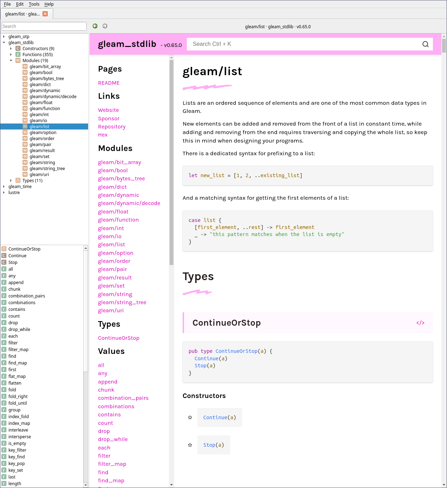

# Hexdocs Zeal

This is a script to download Gleam package documentation to the offline document viewer [Zeal](https://zealdocs.org/).  Zeal is an open source version of the Mac app Dash, but unlike Dash it doesn't have the ability to directly download docs from hexdocs.

When learning gleam, I got tired of switching back and forth between multiple hexdocs tabs.  I wanted docs in Zeal where I can search and work offline.



# Installation

This script is written in [Elvish](https://elv.sh/), a shell and scripting language based on functional programming and typed values. To run it, you will need:

* jq: to create the Zeal search index for modules, types, constructors, and functions
* elvish: to run the script

It will likely only work on unix-derived systems: Linux and MacOS

Copy the `hexdocs.elv` somewhere to your path.  I symlink it to `/usr/local/bin/hexdocs`.

# Managing Package Documentation

```
# add package docs
hexdocs add <package>

# update all package docs
hexdocs update

# remove package docs
hexdocs remove <package>

# remove all hexdocs packages
hexdocs remove all
```

# FAQ

## Why use Elvish?

I wanted to experiment with Elvish scripting and its use of typed values.  This was a small project to learn the language and use it in anger.

## Will it work on Windows?

Probably not, but if you get it to work send a pull request.

## Why not use Zeal feeds?

Zeal has the ability to read docset data from an XML feed and update docsets automatically when new versions are released.  That would be a better way to do it, but I can't be bothered to set up a server just to host a few docsets I can download manually in the terminal.
